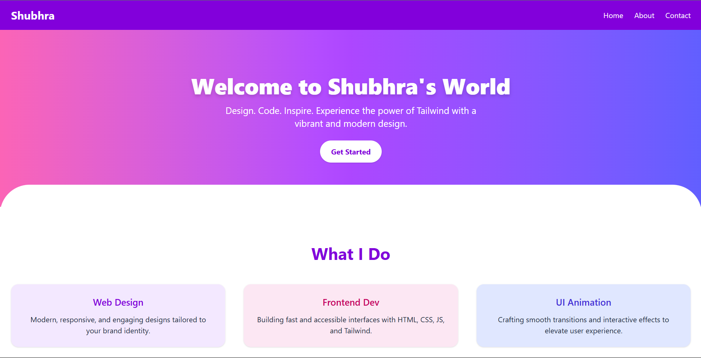
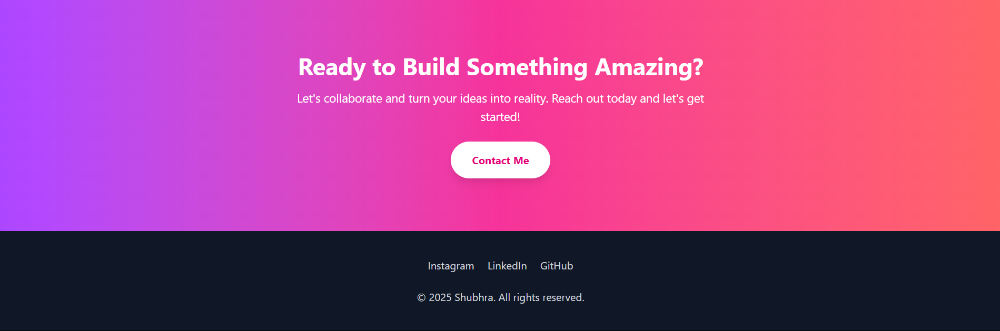

# Shubhra | Tailwind Showcase

A vibrant, responsive personal landing page built using **Tailwind CSS**. This project demonstrates modern design practices with Tailwind's utility-first approach, including responsive layout, gradients, shadows, and a mobile-friendly navigation menu.

## 🌐 Live Preview

To view the site on your local machine:

### 1. Clone or download this repository

```bash
git clone https://github.com/yourusername/shubhra-tailwind-showcase.git
cd shubhra-tailwind-showcase
```

### 2. Setup Tailwind CSS (if not already built)

Make sure you have Tailwind CSS configured with PostCSS. Otherwise, use the CDN version to test it directly.

### 3. Run on Localhost

Simply open the `index.html` in your browser, or run a local server using:

```bash
npx serve .
```
or with Python:

```bash
python3 -m http.server
```

Then open `http://localhost:8000` in your browser.

## 📱 Features

- Responsive mobile-first design
- Gradient backgrounds and vibrant UI
- Hamburger menu for smaller screens
- Smooth hover transitions and shadows
- Fully customizable with Tailwind

## 🛠 Technologies

- HTML5
- Tailwind CSS
- Vanilla JavaScript

## 📂 Folder Structure

```
.
├── index.html
├── src/
│   └── output.css  (Tailwind build output)
└── README.md
```

## 📸 Screenshots




## ✨ Author

**Shubhra** – Frontend Enthusiast & Web Designer

---

© 2025 Shubhra. All rights reserved.